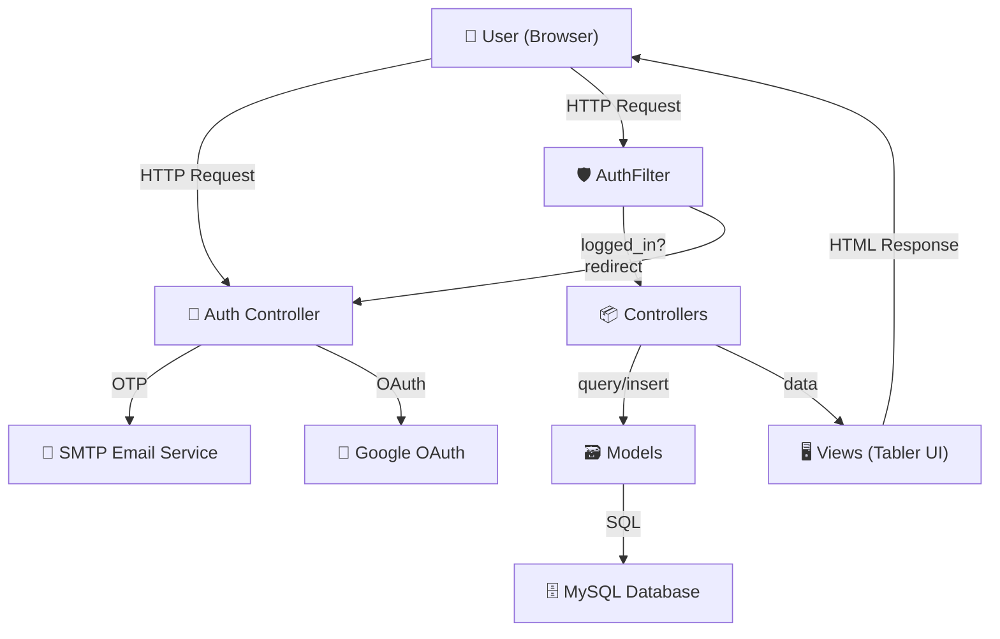
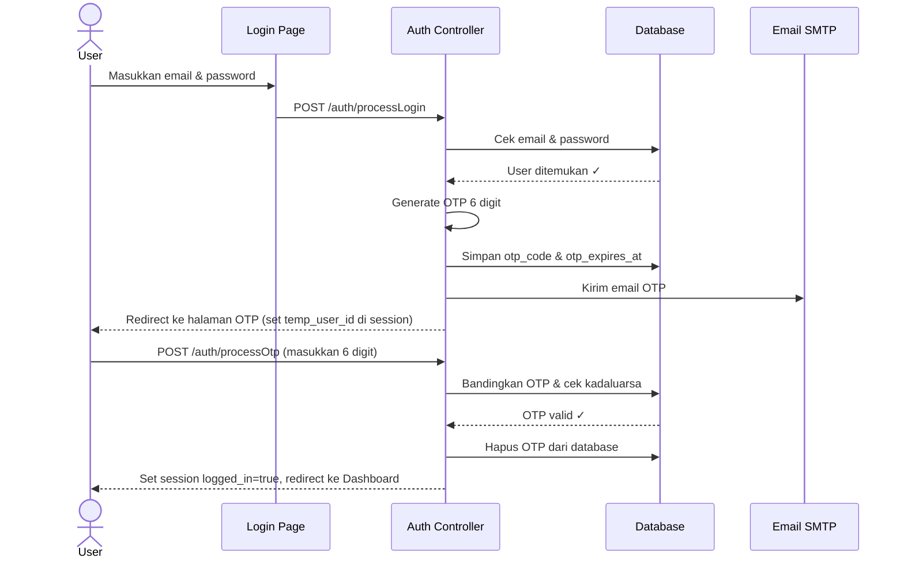
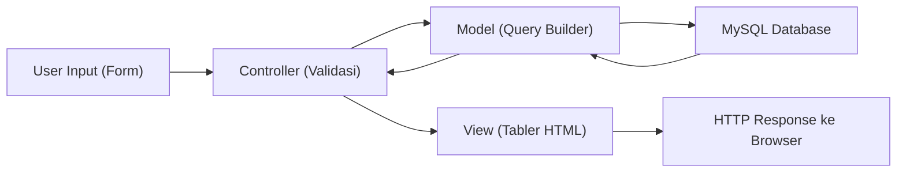
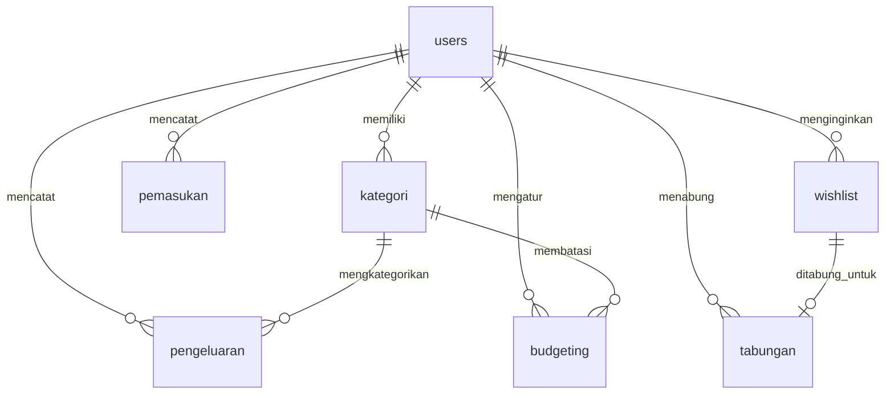

# PLOOM — Codebase Documentation

> Dokumen onboarding untuk Software Engineering Intern. Terakhir diperbarui: 30 Mei 2026.

---

## 1. Project Overview

**PLOOM** (sebelumnya bernama FinTrack) adalah aplikasi web **Sistem Informasi Keuangan Pribadi**. Dibangun menggunakan framework **CodeIgniter 4** dengan arsitektur **MVC (Model-View-Controller)** dan UI kit **Tabler**.

### Masalah yang Diselesaikan
Banyak orang kesulitan melacak pemasukan dan pengeluaran harian mereka. PLOOM menyediakan satu tempat terpusat untuk mencatat transaksi keuangan, mengatur budget, menyimpan wishlist, dan menabung untuk tujuan tertentu.

### Pengguna Aplikasi
Individu yang ingin mengelola keuangan pribadinya secara digital.

### Use Case Utama
- Mencatat pemasukan dan pengeluaran harian
- Membuat budget bulanan per kategori
- Menyimpan daftar keinginan (wishlist) dan target tabungan
- Melihat laporan keuangan dan mengekspornya
- Login aman dengan OTP (One-Time Password) via email

---

## 2. High Level Architecture



### Komponen Utama
| Komponen | Teknologi | Fungsi |
|----------|-----------|--------|
| Backend | CodeIgniter 4 (PHP 8.x) | Logika bisnis, routing, validasi |
| Frontend | Tabler UI + Chart.js | Antarmuka pengguna, grafik |
| Database | MySQL/MariaDB | Penyimpanan data |
| Email | SMTP (Gmail) | Pengiriman kode OTP |
| OAuth | Google OAuth 2.0 | Login via Google |

---

## 3. Folder Structure Explanation

```text
fintrack/
├── app/                        # Kode aplikasi utama
│   ├── Config/                 # Konfigurasi (Routes, Filters, Email, Database)
│   ├── Controllers/            # Logika bisnis (11 file)
│   ├── Database/
│   │   ├── Migrations/         # Skema tabel database (15 file)
│   │   └── Seeds/              # Data dummy untuk demo
│   ├── Filters/                # Middleware (AuthFilter)
│   ├── Models/                 # Akses database (7 model)
│   └── Views/                  # Tampilan HTML
│       ├── auth/               # Login, Register, OTP, Reset Password
│       ├── layout/             # Template utama (main, sidebar, auth)
│       ├── dashboard/          # Halaman utama
│       ├── pemasukan/          # CRUD Pemasukan
│       ├── pengeluaran/        # CRUD Pengeluaran
│       ├── budgeting/          # CRUD Budget
│       ├── wishlist/           # CRUD Wishlist
│       ├── tabungan/           # CRUD Tabungan
│       ├── laporan/            # Laporan & Export
│       ├── profile/            # Profil pengguna
│       ├── pengaturan/         # Pengaturan kategori
│       └── pagers/             # Template pagination
├── public/                     # File yang bisa diakses browser (CSS, JS, uploads)
├── writable/                   # Log, cache, session
├── .env                        # Konfigurasi environment (DB, SMTP, OAuth)
├── composer.json               # Dependencies PHP
└── spark                       # CLI tool CodeIgniter
```

### Aturan Penempatan File
| Jenis File | Taruh di | Contoh |
|------------|----------|--------|
| Logika bisnis baru | `app/Controllers/` | `NamaModul.php` |
| Query database baru | `app/Models/` | `NamaModulModel.php` |
| Halaman HTML baru | `app/Views/namaModul/` | `index.php`, `create.php` |
| Perubahan skema DB | `app/Database/Migrations/` | Jalankan `php spark make:migration` |
| Route baru | `app/Config/Routes.php` | Tambahkan di grup `auth` atau `protected` |

---

## 4. Application Flow

### Alur Login (dengan OTP)



### Alur CRUD Standar (contoh: Pemasukan)
1. User buka `/pemasukan` → Controller `index()` → Model `getByUser()` → View `index.php`
2. User klik "Tambah" → Controller `create()` → View `create.php`
3. User submit form → Controller `store()` → Validasi → Model `insert()` → Redirect
4. User klik "Edit" → Controller `edit($id)` → Cek kepemilikan → View `edit.php`
5. User submit → Controller `update($id)` → Validasi → Model `update()` → Redirect
6. User klik "Hapus" → Controller `delete($id)` → Cek kepemilikan → Model `delete()` → Redirect

---

## 5. Core Modules

### 5.1 Autentikasi (Auth)
- **Purpose**: Mengelola login, register, OTP, lupa password, dan Google OAuth
- **Why**: Keamanan 2 langkah (password + OTP) melindungi akun pengguna
- **Files**: `Auth.php` (Controller), `AuthFilter.php` (Middleware), `UserModel.php`, views di `auth/`
- **Session Keys**: `temp_user_id` (OTP login), `temp_reset_user_id` (reset password), `user_id` + `logged_in` (login penuh)

### 5.2 Dashboard
- **Purpose**: Ringkasan keuangan (saldo, pemasukan/pengeluaran bulan ini, health score, grafik)
- **Files**: `Home.php`, `dashboard/index.php`
- **Health Score**: Dihitung dari 3 komponen: spending ratio (35%), saving ratio (35%), budget discipline (30%)

### 5.3 Pemasukan
- **Purpose**: Mencatat uang masuk (gaji, freelance, bonus)
- **Fields**: tanggal, nominal, sumber, deskripsi
- **Fitur**: Filter (tanggal, nominal, pencarian), sort, pagination

### 5.4 Pengeluaran
- **Purpose**: Mencatat uang keluar dengan kategori
- **Fields**: tanggal, nominal, kategori, metode pembayaran, deskripsi, nota (file upload)
- **Fitur**: Filter (tanggal, kategori, metode, nominal, pencarian), upload bukti nota

### 5.5 Budgeting
- **Purpose**: Menetapkan batas pengeluaran per kategori per bulan
- **How**: Membandingkan `nominal_budget` dengan total pengeluaran aktual per kategori. Persentase dihitung di Controller.

### 5.6 Wishlist
- **Purpose**: Daftar barang impian
- **Status**: `belum_mulai` → `menabung` → `tercapai`
- **Prioritas**: `rendah`, `sedang`, `tinggi`

### 5.7 Tabungan
- **Purpose**: Target menabung, bisa dikaitkan dengan wishlist
- **Progress**: Dihitung di Controller (`nominal_terkumpul / target_nominal * 100`)

### 5.8 Laporan
- **Purpose**: Laporan keuangan dengan filter rentang tanggal dan fitur export/print
- **Files**: `Laporan.php`, `laporan/index.php`, `laporan/print.php`

### 5.9 Profile & Pengaturan
- **Profile**: Update nama, password, avatar
- **Pengaturan**: CRUD kategori pengeluaran, default metode pembayaran

---

## 6. File-by-File Explanation (Key Files)

### `app/Config/Routes.php`
- Mendefinisikan semua URL aplikasi
- Rute dibagi 2 grup: **publik** (auth, tanpa filter) dan **protected** (dengan filter `auth`)
- Setiap modul CRUD memiliki 6 rute standar: index, create, store, edit, update, delete

### `app/Filters/AuthFilter.php`
- Middleware yang berjalan **sebelum** setiap request ke rute protected
- Mengecek `session()->get('logged_in')`. Jika false → redirect ke login
- Didaftarkan sebagai alias `auth` di `Config/Filters.php`

### `app/Controllers/Auth.php` (646 baris)
File terbesar. Berisi:
- `processLogin()`: Validasi kredensial → generate OTP → kirim email → set `temp_user_id`
- `processOtp()`: Validasi OTP → set `user_id` + `logged_in` → redirect dashboard
- `sendOtpEmail()`: Fungsi reusable dengan parameter `$context` ('login' atau 'reset')
- `processForgotPassword()` → `processResetOtp()` → `processResetPassword()`: Alur reset password
- `googleCallback()`: Handle OAuth callback, auto-create user jika belum ada

### `app/Models/PengeluaranModel.php`
Model paling kompleks. Berisi:
- `getByUser()`: Query dengan 7 filter opsional + JOIN kategori
- `getMonthlyTotals()`: Data untuk grafik bulanan
- `getTotalByKategori()`: Untuk perbandingan budget vs aktual

### `app/Views/layout/main.php`
Template induk yang dipakai semua halaman protected. Berisi:
- Navbar dengan avatar pengguna (fallback ke inisial)
- Sidebar (di-include dari `sidebar.php`)
- Flash message handler (success/error)
- Footer dengan versi aplikasi

---

## 7. Data Flow



Setiap tahap:
1. **User Input**: Data dari form HTML dikirim via POST/GET
2. **Controller**: Menerima request, menjalankan validasi CodeIgniter (`$this->validate()`)
3. **Model**: Menggunakan Query Builder CI4, BUKAN raw SQL. Semua query di-scope per `user_id`
4. **Database**: MySQL menyimpan/mengambil data
5. **View**: Menerima `$data` array dari controller, render HTML dengan Tabler UI
6. **Response**: HTML dikirim kembali ke browser

---

## 8. Database Explanation

### Tabel Utama

#### `users`
| Kolom | Tipe | Keterangan |
|-------|------|------------|
| id | BIGINT PK | Auto increment |
| name | VARCHAR(100) | Nama pengguna |
| email | VARCHAR(100) | Email (unique) |
| password | VARCHAR(255) | Bcrypt hash (NULL untuk OAuth-only) |
| avatar | VARCHAR(255) | Nama file foto profil |
| google_id | VARCHAR(255) | ID dari Google OAuth |
| otp_code | VARCHAR(6) | Kode OTP login |
| otp_expires_at | DATETIME | Kadaluarsa OTP login |
| reset_otp_code | VARCHAR(6) | Kode OTP reset password |
| reset_otp_expires_at | DATETIME | Kadaluarsa OTP reset |

#### `kategori`
| Kolom | Tipe | Keterangan |
|-------|------|------------|
| id | BIGINT PK | |
| user_id | BIGINT FK → users | Setiap user punya kategorinya sendiri |
| name | VARCHAR(100) | Nama kategori (Makanan, Transportasi, dll) |

#### `pemasukan`
| Kolom | Tipe | Keterangan |
|-------|------|------------|
| id | BIGINT PK | |
| user_id | BIGINT FK → users | |
| tanggal | DATE | Tanggal transaksi |
| nominal | DECIMAL(15,2) | Jumlah uang masuk |
| sumber | VARCHAR(100) | Sumber pemasukan |
| deskripsi | TEXT | Catatan opsional |

#### `pengeluaran`
| Kolom | Tipe | Keterangan |
|-------|------|------------|
| id | BIGINT PK | |
| user_id | BIGINT FK → users | |
| kategori_id | BIGINT FK → kategori | Jenis pengeluaran |
| tanggal | DATE | |
| nominal | DECIMAL(15,2) | |
| metode_pembayaran | VARCHAR(50) | Cash, Transfer, E-Wallet, dll |
| deskripsi | TEXT | |
| nota | VARCHAR(255) | Path file bukti (opsional) |

#### `budgeting`
| Kolom | Tipe | Keterangan |
|-------|------|------------|
| user_id | BIGINT FK | |
| kategori_id | BIGINT FK | |
| bulan | VARCHAR(2) | "01" s/d "12" |
| tahun | INT | 2026 |
| nominal_budget | DECIMAL(15,2) | Batas pengeluaran |

#### `wishlist`
| Kolom | Tipe | Keterangan |
|-------|------|------------|
| nama_barang | VARCHAR(150) | |
| harga_target | DECIMAL(15,2) | |
| prioritas | ENUM | rendah, sedang, tinggi |
| status | ENUM | belum_mulai, menabung, tercapai |

#### `tabungan`
| Kolom | Tipe | Keterangan |
|-------|------|------------|
| wishlist_id | BIGINT FK (nullable) | Bisa dikaitkan ke wishlist |
| nama_tabungan | VARCHAR(150) | |
| target_nominal | DECIMAL(15,2) | |
| nominal_terkumpul | DECIMAL(15,2) | |
| deadline | DATE | |
| status | ENUM | proses, selesai |

### Relasi Antar Tabel



---

## 9. Business Rules

| # | Aturan | Alasan |
|---|--------|--------|
| 1 | Email harus unik per user | Satu orang = satu akun |
| 2 | OTP berlaku 5 menit | Mencegah brute-force |
| 3 | OTP login dan reset password disimpan di kolom terpisah | Mencegah saling menimpa |
| 4 | Password minimal 8 karakter | Standar keamanan |
| 5 | Setiap query CRUD dicek `user_id` | Isolasi data antar user (multi-tenant) |
| 6 | Kategori tidak bisa dihapus jika masih dipakai di pengeluaran/budgeting | Menjaga integritas data |
| 7 | User Google OAuth tidak bisa ubah password | Mereka tidak punya password lokal |
| 8 | Wishlist status hanya boleh: belum_mulai, menabung, tercapai | Dikontrol oleh ENUM di database |
| 9 | User baru otomatis mendapat 6 kategori default | Makanan, Transportasi, Hiburan, Pendidikan, Belanja, Tagihan |
| 10 | Halaman reset password hanya bisa diakses setelah OTP terverifikasi | Session `reset_otp_verified` harus `true` |

---

## 10. Design Patterns Used

### MVC (Model-View-Controller)
- **Model**: Akses database. Semua query ada di sini, bukan di Controller.
- **View**: Template HTML. Tidak ada logika bisnis, hanya tampilan.
- **Controller**: Penghubung. Menerima request, panggil model, kirim data ke view.

### Filter Pattern (Middleware)
`AuthFilter` berjalan sebelum setiap request ke rute protected. Analoginya: satpam di pintu gedung yang mengecek kartu akses.

### Template Inheritance
View menggunakan `$this->extend('layout/main')` dan `$this->section('content')`. Layout induk mendefinisikan struktur umum (sidebar, navbar, footer), dan setiap halaman hanya mengisi bagian kontennya.

### Active Record / Query Builder
Model tidak menulis SQL mentah. Menggunakan method chaining CI4: `$this->where()->join()->orderBy()->paginate()`.

---

## 11. Common Developer Workflows

### Menambahkan Modul CRUD Baru

1. **Buat Migration**: `php spark make:migration CreateNamaTable`
2. **Jalankan Migration**: `php spark migrate`
3. **Buat Model**: `app/Models/NamaModel.php` — extend `Model`, definisikan `$table`, `$allowedFields`
4. **Buat Controller**: `app/Controllers/Nama.php` — buat method `index`, `create`, `store`, `edit`, `update`, `delete`
5. **Buat Views**: Buat folder `app/Views/nama/` dengan file `index.php`, `create.php`, `edit.php`
6. **Tambah Routes**: Di `app/Config/Routes.php`, tambahkan 6 rute di dalam grup protected
7. **Tambah Sidebar**: Edit `app/Views/layout/sidebar.php`

### Menambahkan Filter pada Halaman List

1. Tambahkan input filter di view `index.php`
2. Ambil parameter filter di Controller via `$this->request->getGet('nama_filter')`
3. Terapkan filter di Model menggunakan `if (!empty($filters['nama'])) { $builder->where(...) }`

### Menjalankan Seeder

```bash
php spark db:seed DemoSeeder      # Data demo umum
php spark db:seed AirdropSeeder   # Data untuk user tertentu
```

---

## 12. Important Configurations

### File `.env`

| Variabel | Contoh | Keterangan |
|----------|--------|------------|
| CI_ENVIRONMENT | development | development/production |
| app.baseURL | http://localhost:8080/ | URL dasar aplikasi |
| database.default.hostname | localhost | Host MySQL |
| database.default.database | fintrack_db | Nama database |
| database.default.username | root | Username MySQL |
| database.default.password | *** | Password MySQL |
| GOOGLE_CLIENT_ID | 696116... | Dari Google Cloud Console |
| GOOGLE_CLIENT_SECRET | GOCSPX-... | Dari Google Cloud Console |
| email.SMTPHost | smtp.googlemail.com | Server SMTP |
| email.SMTPUser | email@gmail.com | Email pengirim |
| email.SMTPPass | xxxx xxxx xxxx xxxx | App Password Gmail |
| email.SMTPPort | 587 | Port SMTP |
| email.SMTPCrypto | tls | Protokol enkripsi (BUKAN "tsl"!) |

> ⚠️ **PENTING**: Jangan pernah commit file `.env` ke Git! File ini berisi kredensial sensitif.

---

## 13. External Integrations

### Google OAuth 2.0
- **Tujuan**: Login tanpa password
- **Library**: `league/oauth2-client` + `league/oauth2-google`
- **Alur**: User klik "Login dengan Google" → Redirect ke Google → Callback → Buat/link akun → Login
- **File**: `Auth.php` method `googleLogin()` dan `googleCallback()`

### SMTP Email (Gmail)
- **Tujuan**: Mengirim kode OTP
- **Service**: `\Config\Services::email()`
- **File**: `Auth.php` method `sendOtpEmail()`
- **Catatan**: Gunakan App Password dari Google, bukan password biasa

---

## 14. Security Considerations

| Aspek | Implementasi |
|-------|-------------|
| **Password Hashing** | `password_hash()` dengan `PASSWORD_DEFAULT` (bcrypt) |
| **OTP** | 6 digit acak (`mt_rand`), kadaluarsa 5 menit, dihapus setelah dipakai |
| **Isolasi Data** | Setiap query dicek `user_id` — user A tidak bisa lihat data user B |
| **CSRF** | CodeIgniter CSRF token via `csrf_field()` di setiap form |
| **Input Validation** | Validasi server-side di Controller sebelum insert/update |
| **File Upload** | Validasi tipe MIME, maksimal 2MB, disimpan dengan nama acak |
| **Session** | Menggunakan FileHandler, `temp_user_id` untuk OTP ≠ `user_id` untuk login |
| **OAuth State** | CSRF protection via `oauth2_state` session parameter |

> ⚠️ **WARNING**: OTP dicatat ke log (`log_message('info', ...)`) untuk keperluan demo. **Hapus baris ini di production!**

---

## 15. Known Technical Debt

| Area | Issue | Impact | Priority |
|------|-------|--------|----------|
| OTP Generation | Menggunakan `mt_rand()` yang tidak cryptographically secure | Rendah untuk aplikasi personal | Low |
| CSRF Token | CSRF filter di-disable secara global di `Filters.php` | Potensi serangan CSRF | Medium |
| File Upload Path | Nota pengeluaran disimpan di `public/assets/uploads/` tanpa validasi path traversal | Risiko keamanan | Medium |
| Rate Limiting | Tidak ada pembatasan percobaan OTP atau login | Rentan brute-force | Medium |
| Error Handling | Beberapa controller tidak menangani exception database | User melihat error mentah | Low |
| Session | OTP log di production harus dihapus | Kebocoran OTP via log file | High |

---

## 16. FAQ for Interns

**Q1: Dari mana request pertama kali masuk?**
Dari `public/index.php` → CodeIgniter bootstrap → `Config/Routes.php` → Controller yang sesuai.

**Q2: Kenapa ada 2 layout (`main.php` dan `auth.php`)?**
`auth.php` untuk halaman publik (login, register) tanpa sidebar. `main.php` untuk halaman setelah login dengan sidebar dan navbar.

**Q3: Apa bedanya `temp_user_id` dan `user_id` di session?**
`temp_user_id` = "ruang tunggu" setelah password benar tapi OTP belum dimasukkan. `user_id` = login penuh setelah OTP terverifikasi.

**Q4: Kenapa OTP login dan reset password pakai kolom database terpisah?**
Agar saat user meminta reset password, OTP login yang sedang aktif tidak tertimpa (dan sebaliknya).

**Q5: Bagaimana cara menambahkan kategori default baru untuk user baru?**
Edit method `createDefaultsForUser()` di `KategoriModel.php`, tambahkan nama kategori di array `$defaults`.

**Q6: Dimana validasi form dilakukan?**
Di Controller, menggunakan `$this->validate($rules, $messages)`. Bukan di Model atau View.

**Q7: Kenapa setiap query selalu ada `where('user_id', $userId)`?**
Untuk isolasi data. Tanpa ini, user bisa melihat atau mengedit data user lain.

**Q8: Bagaimana cara kerja pagination?**
Model memanggil `->paginate($perPage)`, lalu objek `$pager` dikirim ke view. View memanggil `$pager->links()`.

**Q9: Apa itu `AuthFilter` dan kapan dia berjalan?**
Middleware yang mengecek session `logged_in` sebelum request masuk ke controller. Didaftarkan di `Routes.php` via `['filter' => 'auth']`.

**Q10: Bagaimana upload file (nota/avatar) bekerja?**
CodeIgniter menggunakan `$this->request->getFile('field')` lalu `$file->move(path, nama)`. File disimpan di `public/assets/uploads/`.

**Q11: Kenapa pakai Tabler UI, bukan Bootstrap murni?**
Tabler adalah UI kit yang dibangun di atas Bootstrap 5, menyediakan komponen siap pakai (cards, tables, badges) dengan desain profesional.

**Q12: Bagaimana Health Score di dashboard dihitung?**
Tiga komponen: (100 - spending ratio) × 35% + saving ratio × 35% + budget discipline × 30%. Hasilnya dikategorikan: Excellent (≥80), Good (≥60), Fair (≥40), Poor (<40).

**Q13: Apa yang terjadi saat user Google OAuth login pertama kali?**
Sistem membuat akun baru tanpa password (`password = null`), membuat kategori default, dan langsung login.

**Q14: Dimana file CSS dan JS kustom?**
Di `public/assets/css/custom.css` dan `public/assets/js/app.js`.

**Q15: Bagaimana cara menjalankan migration baru?**
`php spark make:migration NamaMigration` untuk membuat file, edit file tersebut, lalu `php spark migrate` untuk menjalankan.

---

## 17. Quick Start Guide

### Prerequisites
- PHP 8.1+ dengan extensions: intl, mbstring, json, mysqlnd, curl
- MySQL/MariaDB 5.7+
- Composer (PHP dependency manager)

### Installation

```bash
# 1. Clone repository
git clone <repo-url> fintrack
cd fintrack

# 2. Install PHP dependencies
composer install

# 3. Salin konfigurasi environment
cp env .env

# 4. Edit .env — sesuaikan database, SMTP, dan OAuth credentials
nano .env

# 5. Buat database
mysql -u root -p -e "CREATE DATABASE fintrack_db"

# 6. Jalankan migrasi database
php spark migrate

# 7. (Opsional) Jalankan seeder untuk data demo
php spark db:seed DemoSeeder
```

### Run Application

```bash
php spark serve --port=8080
```

Buka browser: `http://localhost:8080`

### Akun Demo
| Email | Password |
|-------|----------|
| demo@fintrack.local | password |

### Troubleshooting

| Masalah | Solusi |
|---------|--------|
| "Unable to connect to the database" | Cek kredensial database di `.env` |
| Email OTP gagal terkirim | Pastikan `email.SMTPCrypto = "tls"` (bukan "tsl"), gunakan App Password Gmail |
| Halaman blank setelah login | Cek `writable/logs/` untuk error detail |
| "Class not found" | Jalankan `composer dump-autoload` |
| Migration gagal | Cek `php spark migrate:status` untuk melihat migration yang belum jalan |
